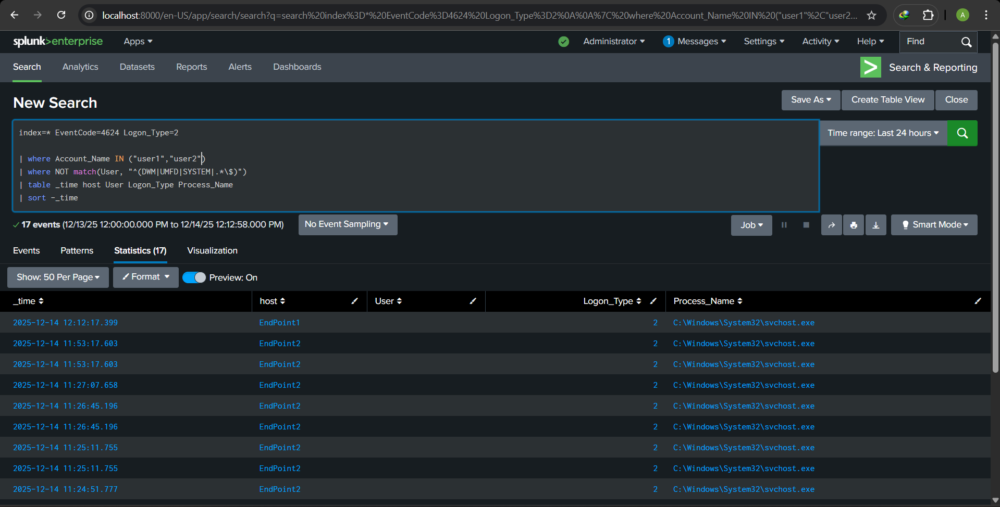

# Event ID 4624 – Successful Logon Report

Hello everyone,

In this report, I'm going to try to explore **Event ID 4624**. This report will include **two parts**: the first one will cover the information and everything we need to know about this event, and the second one will focus on practicing this event in my own **Splunk lab**.

So, as always, let’s proceed step by step, and everything will become clear.

---

## Event ID 4624 – Successful Logon (Basic Information)

- **Event ID:** 4624  
- **Event Name:** An account was successfully logged on  
- **Log Name:** Security  
- **Provider:** Microsoft-Windows-Security-Auditing  
- **Level:** Information  
- **Keywords:** Audit Success

In very simple words:

**4624 is like a hotel check-in log.**  
It records when someone successfully checks into a Windows computer.

Before proceeding into the details, I should mention **two important things** so everything will be crystal clear in this report.

---

## Important Logon Types

- **Type 2 – Interactive:**  
  When the user is physically sitting next to the computer and logs in.

- **Type 3 – Network:**  
  When the user accesses a shared resource without being physically present.

- **Type 5 – Service:**  
  There is no human user here; it’s a Windows service or a scheduled task authentication.

- **Type 10 – RDP:**  
  When the user accesses the system remotely through Remote Desktop.

---

## Account Types

- **Administrator account:**  
  A Windows account with high privileges. It has full control over the system and can delete, modify, or install anything.

- **SYSTEM account:**  
  Not a real user; it represents the Windows operating system itself. It has the highest privileges, even above Administrator, and cannot be used for interactive login.

- **Service account (svc_*):**  
  Not a real user. It’s a special account created to run automated tasks and services such as data backups.

- **Regular user accounts:**  
  Standard employee accounts with limited privileges. They cannot install software or modify system settings.

It was very necessary to define these terms because **Event ID 4624 by itself is not malicious**. Its value comes from combining **logon type, account type, time, and source**.

For example:

> "An admin logged in at 3 AM from an external IP using logon type 10"

That is definitely suspicious.

So that’s what we’re going to do in the practice part of this report: we will work on different scenarios, identify what is suspicious, and create dashboards to alert on suspicious activities using the information provided by this event.

---

## Practice Part

### 1. Interactive Logons (Logon Type 2)

First, we create a simple query to search for successful logons (**Event ID 4624**) with **Logon Type 2 (interactive)** for `user1` and `user2`. This helps us verify which human users have logged in to our endpoints while ignoring system accounts.

**Query:**
```spl
index=* EventCode=4624 Logon_Type=2
| where Account_Name IN ("user1","user2")
| where NOT match(Account_Name, "^(DWM|UMFD|SYSTEM|.*\\$)")
| table _time host Account_Name Logon_Type Process_Name
| sort -_time
```




---

### 2. External Logons (Logon Types 3 and 10)

Next, we create a query to search for external logins where the logon types are **3 and 10**, which are most commonly used for **RDP** or **shared folder access**.

You can see that it’s not working well here, but that’s only because I didn’t perform any RDP login to one of my endpoints. If there were a login, it would trigger an alert.

**Query:**
```spl
index=* EventCode=4624 Logon_Type IN (3,10)
| where Account_Name IN ("user1","user2")
| where NOT cidrmatch("192.168.0.0/16", Source_Network_Address)
| where NOT cidrmatch("10.0.0.0/8", Source_Network_Address)
| where NOT cidrmatch("172.16.0.0/12", Source_Network_Address)
| where Source_Network_Address!="-"
| where Source_Network_Address!="::1"
| where Source_Network_Address!="127.0.0.1"
| where NOT match(Account_Name, "^(DWM|UMFD|SYSTEM|.*\\$)")
| table _time host Account_Name Logon_Type Source_Network_Address Process_Name
| sort -_time
```


---

### 3. Brute Force Attack Detection

The last dashboard used in this report is a **brute force attack detector**.

We simulate this by trying to log in with a wrong password **four times**, then entering the correct password on one of our endpoints.

**Query:**
```spl
index=* (EventCode=4625 OR EventCode=4624) Logon_Type=2 Account_Name=user2
| bin span=10m _time
| stats count(eval(EventCode=4625)) AS FailCount, values(EventCode) AS Events by Account_Name, _time, Source_Network_Address
| where FailCount >= 4 AND mvcount(mvfilter(Events=4624)) > 0
| sort -FailCount
```

We used **Event ID 4625**, which represents **failed logon attempts**.


---

that's all for this report, there was not something very complex because it's  just the start.
see you in other report.


